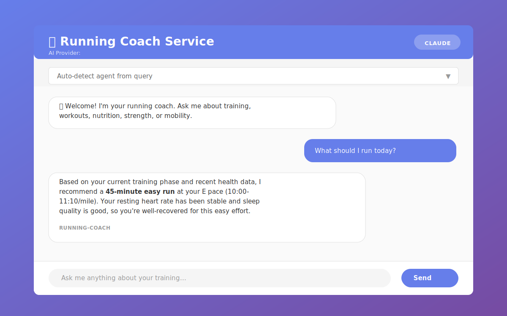
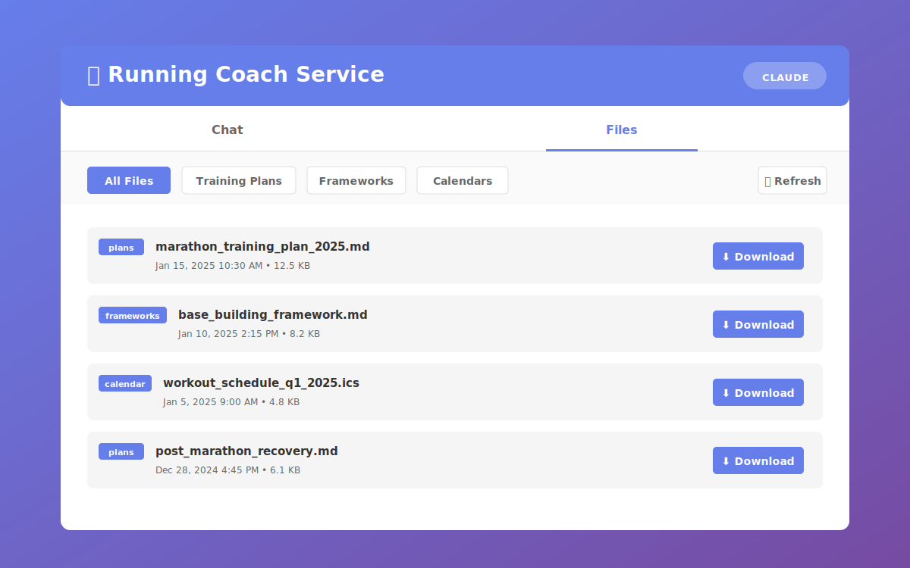

# Running Coach System

A dockerized, AI-agnostic web service that provides personalized training guidance across four domains: running, strength, mobility, and nutrition. Integrates objective health data from Garmin Connect and supports multiple AI providers (Claude, ChatGPT, Gemini, and local LLMs via Ollama).

## Screenshots

### Chat Interface


*Chat with your AI running coach - get personalized training advice with auto-agent routing*

### File Downloads


*Save and download AI-generated training plans, frameworks, and calendars*

## Features

### 🐳 Docker Deployment & AI Flexibility

- **Dockerized Service** - Run anywhere with Docker, simple deployment to home servers
- **AI Provider Agnostic** - Choose from Claude (Anthropic), ChatGPT (OpenAI), Gemini (Google), or Ollama (local LLMs)
- **REST API** - Simple HTTP interface for chat and coaching queries
- **Web Interface** - Clean, responsive UI for interacting with coaches
- **File Downloads** - Save and download AI-generated training plans, frameworks, and calendars
- **Data Persistence** - All athlete data and configurations persist across container restarts
- **Easy Integration** - Use from web browsers, mobile apps, Home Assistant, or custom scripts

### 🏃 Specialized Coaching Domains

- **Running Coach** - VDOT-based training using Jack Daniels methodology with periodized workout planning
- **Strength Coach** - Runner-specific strength training coordinated with running schedule
- **Mobility Coach** - Recovery protocols and flexibility work for distance running
- **Nutrition Coach** - Fueling strategies for endurance training with dietary customization

### 📊 Health Data Integration

- **Direct Garmin Connect Sync** - Automatic import of activities, sleep, HR, and VO2 max data
- **HR Zone Analysis** - Time-in-zone data for each activity to verify workout intensity distribution
- **Lactate Threshold Tracking** - Auto-detected threshold heart rate and pace for validating VDOT
- **Calendar Integration** - Import scheduled workouts from FinalSurge, TrainingPeaks, or any ICS calendar
- **Recovery Monitoring** - Track resting heart rate, HRV, sleep quality, and training readiness
- **Performance Tracking** - Monitor pace progression, training load, and race predictions

### 📚 Workout Library

- **Searchable Database** - 19+ pre-built workout templates across all coaching domains
- **Smart Filtering** - Search by domain, type, difficulty, duration, VDOT range, equipment, and tags
- **Easy Customization** - Import workouts as templates and adapt to athlete-specific needs
- **Command-Line Access** - Simple CLI for browsing and managing workouts

### 🎯 Personalized Training

- Athlete-specific context files for goals, preferences, and constraints
- Data-driven coaching decisions based on objective metrics
- Conservative adjustments when recovery is compromised
- Coordination across all coaching domains

### 💬 Flexible Communication

- **Adjustable Detail Levels** - Choose BRIEF, STANDARD, or DETAILED response modes
- **BRIEF Mode** (default) - Quick, scannable workouts with just time/intensity/pace
- **STANDARD Mode** - Balanced guidance with context and rationale
- **DETAILED Mode** - Comprehensive explanations with physiological reasoning
- **Dynamic Switching** - Change detail level anytime during coaching sessions

## Quick Start

### Docker Deployment (Recommended)

**Prerequisites:**
- Docker and Docker Compose
- API key for your chosen AI provider (or Ollama for free local LLMs)
- (Optional) Garmin Connect account for health data sync

**Setup:**

1. **Clone the repository**
   ```bash
   git clone <repository-url>
   cd running-coach
   ```

2. **Configure environment**
   ```bash
   cp .env.example .env
   nano .env  # Edit with your AI provider and API key
   ```

   Example configurations:
   ```bash
   # Using Claude (Anthropic)
   AI_PROVIDER=claude
   ANTHROPIC_API_KEY=sk-ant-your-key-here

   # Or using ChatGPT (OpenAI)
   AI_PROVIDER=openai
   OPENAI_API_KEY=sk-your-key-here

   # Or using Gemini (Google)
   AI_PROVIDER=gemini
   GOOGLE_API_KEY=your-google-api-key

   # Or using Ollama (local, free)
   AI_PROVIDER=ollama
   ```

3. **Start the service**
   ```bash
   # Using cloud AI providers (Claude/OpenAI/Gemini)
   docker-compose up -d

   # Or with Ollama for local LLMs
   docker-compose --profile ollama up -d
   docker exec ollama ollama pull llama3.1:latest
   ```

4. **Access the service**

   Open your browser: **http://localhost:5000**

   Or use the API:
   ```bash
   curl -X POST http://localhost:5000/api/v1/chat \
     -H "Content-Type: application/json" \
     -d '{"query": "What should I run today?"}'
   ```

**See [DOCKER_DEPLOYMENT.md](docs/DOCKER_DEPLOYMENT.md) for complete deployment guide.**

### Alternative: Claude Code Integration

You can also use this project directly in [Claude Code](https://docs.claude.com/en/docs/claude-code) without Docker:

1. Clone the repository and open in Claude Code
2. Set Garmin credentials: `export GARMIN_EMAIL=...` and `export GARMIN_PASSWORD=...`
3. Install dependencies: `pip install -r requirements.txt`
4. Sync health data: `bash bin/sync_garmin_data.sh --days 90`
5. Interact with the coaching agents directly in Claude Code

The agents in `.claude/agents/` will automatically load your athlete profile and health data.

### Customize Your Athlete Profile

Edit the files in `data/athlete/` to personalize your coaching:

- `goals.md` - Your performance goals and training objectives
- `training_preferences.md` - Schedule constraints and workout preferences
- `training_history.md` - Injury history and past training patterns
- `upcoming_races.md` - Race schedule and goal times
- `current_training_status.md` - Current VDOT and training phase
- `communication_preferences.md` - Detail level for coaching responses (BRIEF/STANDARD/DETAILED)

## Usage

### Sync Health Data

```bash
# Standard sync (last 30 days) with summary
bash bin/sync_garmin_data.sh

# Sync specific number of days
bash bin/sync_garmin_data.sh --days 60

# Preview what would be synced without updating
bash bin/sync_garmin_data.sh --check-only
```

### Work with Coaching Agents

The system uses specialized AI coaching agents defined in `.claude/agents/`:

- `vdot-running-coach.md` - Running workouts and pacing
- `runner-strength-coach.md` - Strength programming
- `mobility-coach-runner.md` - Mobility and recovery
- `endurance-nutrition-coach.md` - Nutrition and fueling

**Using the Docker Web Service:**

The service automatically routes queries to the appropriate agent:

```bash
# Web interface (recommended for most users)
# Open http://localhost:5000 in your browser

# REST API - auto-detect agent
curl -X POST http://localhost:5000/api/v1/chat \
  -H "Content-Type: application/json" \
  -d '{"query": "What should I run today?"}'

# REST API - specify agent
curl -X POST http://localhost:5000/api/v1/chat \
  -H "Content-Type: application/json" \
  -d '{"query": "Design a strength workout", "agent": "strength-coach"}'
```

**API Versioning:**
- Current API version: **v1** (`/api/v1/*`)
- Backward compatibility maintained for `/api/*` routes (redirect to v1)
- Rate limiting: 200 requests/hour (global), 20 requests/minute (chat endpoints)

See [API_CLIENT_EXAMPLES.md](docs/API_CLIENT_EXAMPLES.md) for Python, JavaScript, and integration examples.

**Using Claude Code:**

When using Claude Code, these agents automatically access your athlete profile and health data. Simply open this repository in Claude Code and interact with the agents conversationally.

### Control Response Detail Level

Choose how much detail you want in coaching responses:

```bash
# View current detail setting
head -5 data/athlete/communication_preferences.md

# Or just ask the coach to switch modes:
# "Switch to brief mode"
# "Give me detailed explanations"
# "Use standard detail level"
```

**Example Outputs:**

**BRIEF Mode** (default - quick execution):
```
Tomorrow: 45 min E (10:00-11:10)
Tuesday: 15 min E warmup, 3x10 min T (8:35) w/ 2 min jog, 10 min E cooldown
```

**STANDARD Mode** (balanced context):
```
Tomorrow: 45 min E (10:00-11:10) for recovery
Tuesday: Threshold - 15 min E, 3x10 min T (8:35) w/ 2 min jog, 10 min E
Purpose: lactate threshold development
```

**DETAILED Mode** (comprehensive):
```
Full workout with warmup/cooldown, physiological reasoning,
modification options, integration notes with other training
```

See [COMMUNICATION_PREFERENCES_GUIDE.md](docs/COMMUNICATION_PREFERENCES_GUIDE.md) for complete guide and examples.

### Workout Library

**Browse Pre-Built Workouts**

Access the searchable workout library:

```bash
# View library statistics
bash bin/workout_library.sh stats

# List all workouts (or filter by domain)
bash bin/workout_library.sh list
bash bin/workout_library.sh list --domain running

# Search for specific workouts
bash bin/workout_library.sh search --domain running --type tempo
bash bin/workout_library.sh search --difficulty beginner --duration-max 30
bash bin/workout_library.sh search --tags vo2_max intervals

# Get detailed workout information
bash bin/workout_library.sh get <workout-id>

# Export a workout as JSON
bash bin/workout_library.sh export <workout-id> --output my_workout.json

# Import a custom workout
bash bin/workout_library.sh import my_custom_workout.json
```

The library contains 19+ workouts:
- **Running** (10): Intervals, tempo runs, long runs, recovery runs
- **Strength** (3): Foundation, power, core workouts for runners
- **Mobility** (3): Pre-run, post-run, hip mobility routines
- **Nutrition** (3): Race day, long run fueling, recovery nutrition

All workouts include detailed instructions, duration, difficulty, equipment needs, and searchable metadata.

### Calendar Integration

**Import Workouts (from external sources)**

Using a Calendar URL (Recommended):
```bash
# 1. Configure your calendar source
cp config/calendar_sources.json.example config/calendar_sources.json
# Edit with your calendar URL (e.g., FinalSurge ICS feed)

# 2. Sync - automatically downloads and imports calendar
bash bin/sync_garmin_data.sh
```

Using a Local ICS File:
```bash
# 1. Save your exported .ics file to data/calendar/
mkdir -p data/calendar
# Place training_calendar.ics in this directory

# 2. Run sync
bash bin/sync_garmin_data.sh
```

The system merges calendar events (dates) with Garmin workout templates (details) to create a complete 14-day scheduled workout plan.

**Export Workouts (to external calendars)**

Export scheduled workouts to ICS format for Google Calendar, Outlook, Apple Calendar, etc.:

```bash
# Export next 14 days (default)
bash bin/export_calendar.sh

# Export next 30 days
bash bin/export_calendar.sh --days 30

# Export to custom location
bash bin/export_calendar.sh --output ~/Downloads/workouts.ics

# Export automatically during sync
python3 src/garmin_sync.py --export-calendar --export-days 21
```

Import the generated .ics file:
- **Google Calendar**: Settings → Import & Export → Import
- **Outlook**: File → Import/Export → Import an iCalendar file
- **Apple Calendar**: File → Import

## Architecture

### System Overview

```
┌─────────────┐
│   Client    │  (Web Browser, Mobile App, API Client)
└──────┬──────┘
       │ HTTP
       ▼
┌─────────────────────┐
│  Flask Web Service  │  (src/web/app.py)
└──────┬──────────────┘
       │
       ▼
┌─────────────────────┐
│   Coach Service     │  (src/coach_service/)
│  - Agent routing    │  - Loads athlete context
│  - Context loading  │  - Manages conversation
└──────┬──────────────┘
       │
       ▼
┌─────────────────────┐
│   AI Providers      │  (src/ai_providers/)
│  Claude | OpenAI    │  - Provider abstraction
│  Gemini | Ollama    │  - Unified interface
└─────────────────────┘
```

### Key Components

**Web Service Layer:**
- **`src/web/app.py`** - Flask application with REST API
- **API v1 Endpoints:**
  - `GET /` - Web interface
  - `GET /api/v1/health` - Health check
  - `GET /api/v1/agents` - List available coaches
  - `POST /api/v1/chat` - Coaching queries (rate limited: 20/min)
  - `POST /api/v1/chat/stream` - Streaming responses
  - `GET /api/v1/files` - List saved files
  - `GET /api/v1/files/<category>/<filename>` - Download file
  - `POST /api/v1/files` - Save new file
  - `DELETE /api/v1/files/<category>/<filename>` - Delete file
  - Note: `/api/*` routes maintained for backward compatibility
- **Features:**
  - Structured logging with configurable levels
  - Rate limiting (200/hour global, 20/min chat)
  - CORS enabled for cross-origin requests

**Coach Service Layer:**
- **`src/coach_service/coach.py`** - Main coaching orchestration
- **`src/coach_service/agent_loader.py`** - Loads agent configs from `.claude/agents/*.md`
- Auto-detects appropriate agent based on query keywords
- Manages athlete context and health data loading

**AI Provider Layer:**
- **`src/ai_providers/base.py`** - Abstract provider interface
- **`src/ai_providers/claude.py`** - Anthropic Claude integration
- **`src/ai_providers/openai.py`** - OpenAI ChatGPT integration
- **`src/ai_providers/gemini.py`** - Google Gemini integration
- **`src/ai_providers/ollama.py`** - Local LLM integration
- **`src/ai_providers/factory.py`** - Provider selection

**Health Data System:**
- **`src/garmin_sync.py`** - Garmin Connect API sync
- **`src/ics_parser.py`** - ICS calendar import
- **`src/ics_exporter.py`** - ICS calendar export
- **`bin/sync_garmin_data.sh`** - Sync wrapper script
- **`data/health/health_data_cache.json`** - Cached health metrics

**Workout Library:**
- **`src/workout_library.py`** - Library manager (CRUD)
- **`src/workout_library_cli.py`** - CLI interface
- **`bin/workout_library.sh`** - CLI wrapper
- **`data/library/workout_library.json`** - Workout database

**Athlete Context:**
- **`data/athlete/`** - Profile, goals, preferences, status
- **`.claude/agents/`** - Agent configurations

**See [ARCHITECTURE.md](docs/ARCHITECTURE.md) for complete technical details.**

### Health Data Types

All data synced from Garmin Connect:

- **Activities** - Distance, duration, pace, heart rate, calories
- **Sleep** - Total duration, sleep stages, efficiency
- **VO2 Max** - Garmin estimates
- **Weight** - Body weight, composition
- **Resting Heart Rate** - Daily RHR (key recovery indicator)

## Documentation

**Deployment & Integration:**
- **[DOCKER_DEPLOYMENT.md](docs/DOCKER_DEPLOYMENT.md)** - Complete Docker deployment guide
- **[ARCHITECTURE.md](docs/ARCHITECTURE.md)** - System architecture and design
- **[API_CLIENT_EXAMPLES.md](docs/API_CLIENT_EXAMPLES.md)** - Integration examples (Python, JS, cURL, Home Assistant)
- **[FILE_DOWNLOADS.md](docs/FILE_DOWNLOADS.md)** - Save and download AI-generated files

**Health Data & Features:**
- **[HEALTH_DATA_SYSTEM.md](docs/HEALTH_DATA_SYSTEM.md)** - Technical documentation for health data
- **[AGENT_HEALTH_DATA_GUIDE.md](docs/AGENT_HEALTH_DATA_GUIDE.md)** - Quick reference for agents on health data
- **[AGENT_WORKOUT_LIBRARY_GUIDE.md](docs/AGENT_WORKOUT_LIBRARY_GUIDE.md)** - Workout library integration guide
- **[COMMUNICATION_PREFERENCES_GUIDE.md](docs/COMMUNICATION_PREFERENCES_GUIDE.md)** - BRIEF/STANDARD/DETAILED response modes

**Development:**
- **[CLAUDE.md](CLAUDE.md)** - Development guide for Claude Code integration

## Project Structure

```
running-coach/
├── src/
│   ├── ai_providers/          # AI provider implementations
│   │   ├── base.py            # Abstract base class
│   │   ├── claude.py          # Anthropic Claude
│   │   ├── openai.py          # OpenAI ChatGPT
│   │   ├── gemini.py          # Google Gemini
│   │   ├── ollama.py          # Local LLMs
│   │   └── factory.py         # Provider selection
│   ├── coach_service/         # Core coaching logic
│   │   ├── agent_loader.py    # Load agent configs
│   │   └── coach.py           # Main orchestration
│   ├── web/                   # Flask web service
│   │   ├── app.py             # API and routes
│   │   └── templates/         # Web UI
│   ├── garmin_sync.py         # Garmin Connect sync
│   ├── ics_parser.py          # Calendar import
│   ├── ics_exporter.py        # Calendar export
│   ├── workout_library.py     # Workout library CRUD
│   ├── workout_library_cli.py # Workout CLI
│   └── seed_workout_library.py
├── bin/                       # Executable scripts
│   ├── start_service.sh       # Start web service
│   ├── sync_garmin_data.sh    # Health data sync
│   ├── export_calendar.sh     # Calendar export
│   └── workout_library.sh     # Workout CLI
├── docs/                      # Documentation
│   ├── DOCKER_DEPLOYMENT.md   # Deployment guide
│   ├── ARCHITECTURE.md        # System design
│   ├── API_CLIENT_EXAMPLES.md # Integration examples
│   ├── HEALTH_DATA_SYSTEM.md
│   ├── AGENT_HEALTH_DATA_GUIDE.md
│   ├── AGENT_WORKOUT_LIBRARY_GUIDE.md
│   └── COMMUNICATION_PREFERENCES_GUIDE.md
├── data/
│   ├── athlete/               # Athlete profile & context
│   ├── health/                # Health data cache
│   ├── library/               # Workout library
│   ├── plans/                 # Training plans
│   └── calendar/              # Calendar files
├── .claude/agents/            # AI coaching agents
├── config/                    # Configuration files
├── Dockerfile                 # Container definition
├── docker-compose.yml         # Multi-container setup
├── .env.example              # Config template
├── requirements.txt          # Python dependencies
└── README.md                 # This file
```

## Troubleshooting

### Authentication Issues

```bash
# Verify credentials are set
echo $GARMIN_EMAIL
echo $GARMIN_PASSWORD

# Clear token cache and re-authenticate
rm -rf ~/.garminconnect
bash bin/sync_garmin_data.sh
```

### Health Data Not Updating

```bash
# Run with verbose output
python3 src/garmin_sync.py --days 7 --summary

# Check cache timestamp
python3 -c "import json; print(json.load(open('data/health/health_data_cache.json'))['last_updated'])"
```

### Reset Cache

```bash
# Delete cached data
rm data/health/health_data_cache.json

# Re-sync historical data
bash bin/sync_garmin_data.sh --days 90
```

## Features in Detail

### Garmin Connect Integration

- **OAuth Authentication** - Secure token-based authentication (tokens valid ~1 year)
- **Incremental Sync** - Only fetch new data since last sync
- **Atomic Updates** - Safe concurrent access with atomic file writes
- **De-duplication** - Automatically handles overlapping date ranges

### Training Methodology

- **Jack Daniels VDOT** - Science-based training paces
- **Periodization** - Base → Early Quality → Race-Specific → Taper
- **Recovery-Based Adjustments** - Conservative modifications based on RHR and sleep
- **Multi-Domain Coordination** - Strength, mobility, and nutrition aligned with running

### Dietary Support

The nutrition coach respects dietary requirements configured in `data/athlete/training_preferences.md`:
- Gluten-free meal planning
- Dairy-free alternatives
- Customizable restrictions

## Testing

Basic unit tests are provided for the web service:

```bash
# Run all tests
python -m pytest tests/

# Run specific test file
python -m pytest tests/test_web_app.py

# Run tests with verbose output
python -m pytest tests/ -v
```

**Test Coverage:**
- Web service endpoints (health, agents, chat, files)
- API versioning and backward compatibility
- File management operations
- Rate limiting functionality
- Input validation and error handling

**Configuration for Testing:**
- Structured logging: Set `LOG_LEVEL=DEBUG` for detailed test output
- Rate limiting is disabled in testing mode by default
- Test client uses Flask's testing mode

## Roadmap

This project is actively evolving. Current development priorities:

### Standalone Application
- [x] **Decouple from Claude Code** - Make coaching agents accessible without Claude Code dependency ✅
- [x] **HTTP/REST API** - Provide web service interface for coaching interactions ✅
- [x] **Web Frontend** - Build user-friendly web interface for athlete interaction ✅
- [x] **Mobile-responsive UI** - Support access from phones and tablets ✅
- [x] **AI Provider Agnostic** - Support Claude, OpenAI, Gemini, and Ollama ✅
- [x] **Docker Deployment** - Containerized service for easy deployment ✅

### Data & Persistence
- [ ] **Database Integration** - Replace JSON files with proper database (PostgreSQL/SQLite)
- [ ] **Chat History** - Store and retrieve coaching conversation history
- [ ] **Training Plan Versioning** - Track plan changes over time
- [ ] **Multi-athlete Support** - Support multiple athlete profiles in single instance

### Enhanced Features
- [x] **Workout Library** - Searchable database of workouts and training blocks
- [x] **Adjustable Communication Detail** - BRIEF/STANDARD/DETAILED response modes for coaching agents
- [ ] **Progress Visualization** - Charts and graphs for training metrics over time
- [ ] **Automated Plan Generation** - Generate multi-week training plans based on race goals
- [ ] **Email/SMS Notifications** - Workout reminders and recovery alerts
- [ ] **Integration Testing** - Comprehensive test suite for all coaching domains
- [ ] **Additional Wearables** - Support for Strava, Polar, Wahoo, etc.

### Community & Collaboration
- [ ] **Multi-coach Support** - Allow multiple coaching perspectives/methodologies
- [ ] **Sharing & Templates** - Share workout templates and training frameworks
- [ ] **Community Forums** - Athlete discussion and peer support
- [ ] **Coach Dashboard** - Interface for human coaches to monitor athlete progress

### Advanced Analytics & Intelligence
- [x] **HR Zone Analysis** - Time-in-zone tracking for each activity to validate workout intensity
- [x] **Lactate Threshold Tracking** - Auto-detected threshold HR and pace from Garmin for VDOT validation
- [x] **HRV Tracking** - Heart rate variability monitoring for recovery assessment
- [x] **Training Readiness** - Daily readiness scores incorporating sleep, HRV, and recovery metrics
- [ ] **Injury Risk Prediction** - ML model to detect overtraining patterns from training load trends
- [ ] **Automated VDOT Adjustments** - Update training paces based on race results and workout performance
- [ ] **Performance Prediction** - Race time estimates based on current fitness and training phase (partially complete: Garmin race predictions available)
- [ ] **Training Load Analytics** - Acute/chronic workload ratio, TSS/CTL tracking

### Mobile & Offline Support
- [ ] **Native iOS/Android Apps** - Full-featured mobile applications
- [ ] **Offline Mode** - Access plans and log workouts without internet connection
- [ ] **Watch App Integration** - Apple Watch, Garmin Connect IQ companion apps
- [ ] **Push Notifications** - Workout reminders and recovery alerts on mobile devices

### Extended Integrations
- [ ] **Strava Sync** - Two-way sync of activities and training data
- [ ] **TrainingPeaks Integration** - Import/export structured workouts and plans
- [ ] **Zwift Integration** - Indoor training workouts and structured plans
- [ ] **Weather API** - Real-time weather data for workout planning and race day
- [x] **Calendar Sync Export** - Export workouts to Google Calendar, Outlook, Apple Calendar (ICS format)

### Race Day Features
- [ ] **Race Strategy Generator** - Custom pacing plan based on course elevation profile
- [ ] **Course Analysis** - Import GPX files and analyze elevation, terrain, splits
- [ ] **Pre-race Checklist** - Equipment, nutrition, logistics planning tools
- [ ] **Race Day Weather** - Location-specific forecasts and gear recommendations
- [ ] **Multi-Race Season Planning** - Coordinate multiple goal races throughout the year

Contributions welcome! See [Contributing](#contributing) section for guidelines.

## License

[Add your license information here]

## Contributing

[Add contribution guidelines here]

## Support

For issues or questions:
1. Check the documentation in `docs/`
2. Review the troubleshooting section above
3. [Add your support contact or issue tracker link]
